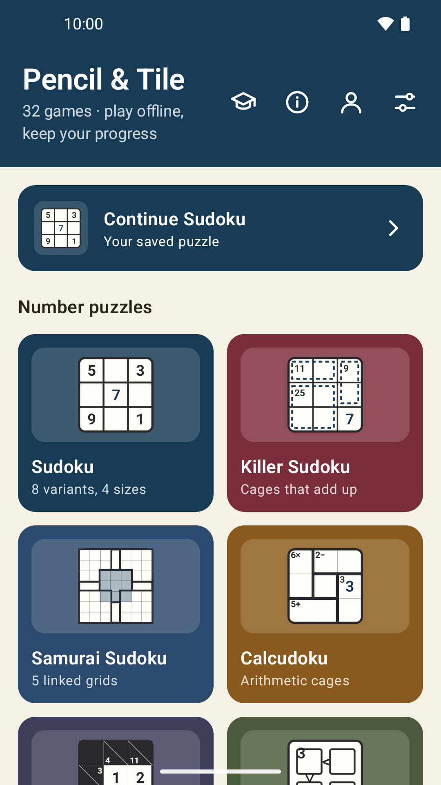
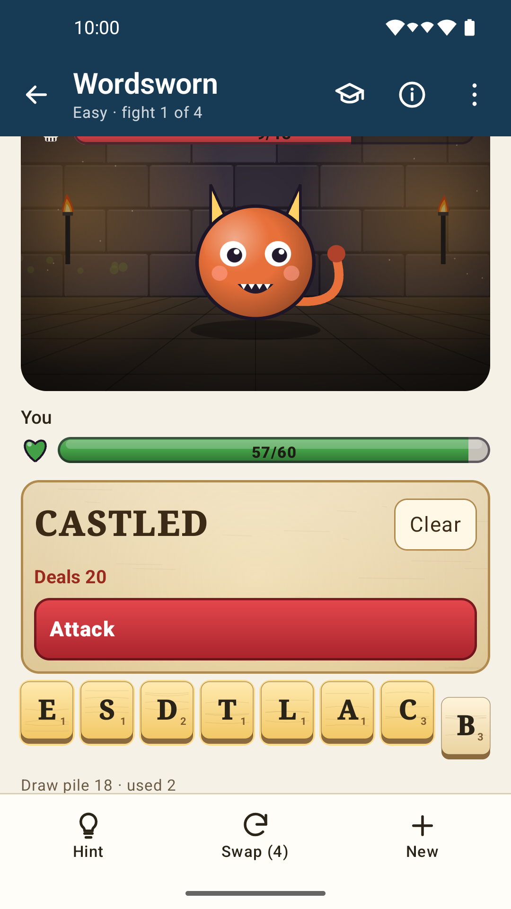
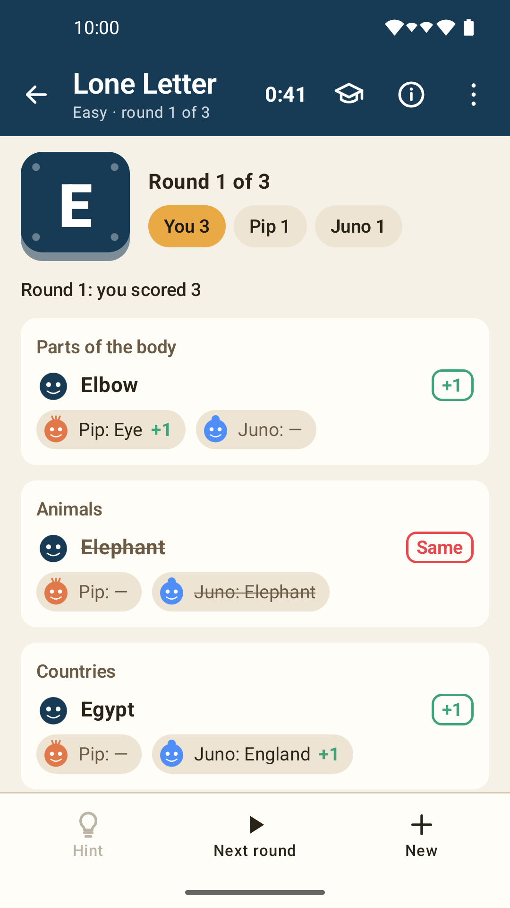
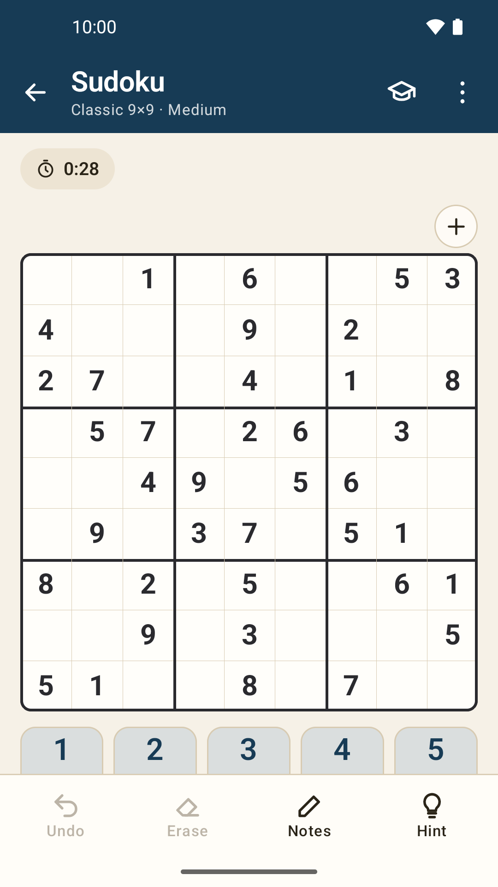

# Pencil & Tile

A quiet collection of 38 puzzle, word, card and board games for Android. Everything plays offline, with
no ads, no account and no tracking.

**Try it:** join the test on Google Play at
https://play.google.com/apps/testing/com.simplegamegen.puzzles, then install from
https://play.google.com/store/apps/details?id=com.simplegamegen.puzzles

<p>




</p>

- **Number puzzles:** Sudoku (eight variants and four sizes, with Killer and Samurai Sudoku under it),
  Calcudoku, Kakuro, Futoshiki, Nonograms and Hitori.
- **Word games:** Wordsworn (battle monsters with words), Letter Sprawl, Word Quilt, Lone Letter,
  Blotwords, Common Threads, Five Letters, Word Meaning, crossword, word search, Hangman, cryptogram,
  word scramble, acrostic, code cracker and dropquote.
- **Cards and tiles:** Mahjong Solitaire, Solitaire (Klondike, with Spider and Pyramid under it), Dominoes
  and Memory.
- **Board and strategy:** Minesweeper, Checkers, Reversi, Dots and Boxes, Sprouts and Magnetic cluster.
- **Classics:** Connect Four.
- **Arcade:** 2048 and Tetras.

Every game has a guided tutorial, four levels, hints, themes and dark mode, screen-reader support, and
English, 简体中文, 日本語, Español and Deutsch.

Built with Kotlin and Jetpack Compose on a pure-Kotlin engine (`sudoku-engine`); each game saves on its own.

## Number puzzles

- **16×16 Sudoku:** digits 1–16 in 4×4 boxes, as Classic, X (both diagonals),
  Jigsaw or Killer, at four levels. Every puzzle is proven to have one answer;
  Easy and Medium (and every 16×16 Killer) can be solved step by step without
  guessing.
- **Custom grid editor** (Sudoku screen → Custom grid editor): build any grid
  from 4×4 to 16×16. Paint your own regions (or pick box shapes or a random
  jigsaw), add Killer cages, odd/even squares, extra groups such as Windoku
  windows, and whole-grid rules (both diagonals, anti-knight, anti-king,
  non-consecutive). Place starting digits yourself or let the editor fill them
  in. A live checker reports broken layouts, clashing digits, no answer, more
  than one answer (and where the answers differ), or "Ready to play". Only grids
  with exactly one answer can be played or shared as a code (starting SGG1).

- **Killer Sudoku:** a Sudoku variant (9×9) with its own home tile. Cages are
  drawn as dashed outlines with their sums, as in printed puzzles.
- **Samurai Sudoku:** five 9×9 grids that share their corner boxes (369 squares).
  A map shows the whole board; tap a grid, or use the X-shaped picker, to play it
  full size. Easy to Expert leave about 215/185/160 givens, or as few as
  uniqueness allows.
- **Calcudoku:** 4×4 to 7×7 by level. Every row and column holds each digit once,
  and each cage's digits make its target with the shown operation. Easy uses
  only + and −.
- **Kakuro:** 6×6 to 12×12 cross-sum boards. Each run of white squares adds up to
  its clue with no repeated digit.
- **Futoshiki:** 4×4 to 7×7 Latin squares with greater-than signs between
  squares; easier levels add givens and more signs.
- **Nonograms:** 5×5 to 12×12 pictures from row and column run clues. Fill and
  Cross modes; drag along a row or column to paint several squares. Every
  picture is solvable line by line, so it has one answer.
- **Hitori:** 5×5 to 8×8. Shade repeated numbers so shaded squares never touch
  and the white squares stay connected. Tap to shade, again to circle, again to
  clear. Each puzzle is proven to have exactly one shading.
- Samurai, Calcudoku, Kakuro and Futoshiki have notes, Undo, Erase, Check (marks wrong squares) and Hint (reveals
  the selected or first wrong square), with live highlighting of repeats, wrong
  cage results and runs over their sum. Every puzzle is proven to have exactly
  one solution before it replaces a save.

## More word games

- **Cryptogram:** a public-domain saying (proverbs, pre-1900 authors, the King
  James Bible, U.S. presidential speeches) in a letter-swap code. Tap a coded
  letter, then type its letter. Check, Hint and Undo are available.
- **Word scramble:** rounds of eight jumbled words. Tap tiles to spell; any real
  bundled word with the same letters counts. Shuffle, Hint and Skip.
- **Acrostic:** answer the clues; the first letters, read down, spell a hidden word.
- **Code cracker:** a clue-free crossword (9×9 to 13×13) where each number
  stands for a letter. Choose a number, type its letter, and every matching
  square fills. 5/3/2/1 letters are given by level.
- **Dropquote:** a public-domain saying hidden in a grid; each column's letters
  sit above it in alphabetical order. Tap a square, then a letter from its column.
- **Blotwords:** ink every square of a letter grid by writing invented command
  words (VUM, DRIF, ZUV, KEL) in straight lines, forwards or backwards; inked
  squares drop out of the way. What each word does is found out by playing: the
  Discover trail brings them in one small puzzle at a time, each of which can't
  be finished without its new word. Grids are built backwards from a fully
  inked grid, so every one can be finished, and Hint follows that solution.
  Themes change only the look and motion: the built-in **Ink** theme (a purple
  octopus, ink that bleeds into the paper) and **Mermaids and the Sea** (a
  cartoon mermaid, squares of moving water), plus a theme studio where players
  mix colors, drawn parts, their own pictures (creature, squares, board,
  celebration pieces) and animations (how squares fill, speed, stroke timing,
  creature moves, celebrations, tracing trail), with a live preview.

## Word games

- **Crossword:** connected grids with numbered Across/Down clues from
  a bank of 120 original English clues. Tap a clue or square, enter a full answer,
  check it, or reveal a letter. Shared letters update both crossing answers.
- **Word search:** 12 themes with 20 words each: Nature, Animals, Space,
  Everyday, Food, Travel, Sports, Music, Ocean, Weather, Garden and Science.
  Each new puzzle selects a fresh word list and layout. Tap the two endpoints
  of a word; reverse selection also works. Hints highlight a starting letter.
- Each mode saves its complete board, entered answers/found words and hint
  count separately from Sudoku. Reopening a mode restores it automatically.
  New puzzle replaces only that mode's save after confirmation and successful
  generation. Completed boards remain available until replaced.
- Grids use 48 dp touch targets and scroll horizontally on narrow screens.
  Crosswords use connected English clue grids, not newspaper-style symmetry.

Choose **New puzzle**, then a difficulty (and a search theme), then **Start
puzzle**. Settings affect the new board, not a game already in progress.

| Difficulty | Crossword | Word search |
| --- | --- | --- |
| Easy | 7×7, 4–5 clues, 3–5 letter answers | 8×8, 6 short words, right/down |
| Medium | 9×9, 6–8 clues, 4–7 letter answers | 9×9, 8 words, right/down/down-right diagonal |
| Hard | 11×11, 8–10 clues, 5–8 letter answers | 10×10, 10 words, all eight directions |
| Expert | 12×12, 10–12 clues, 6–10 letter answers | 12×12, 12 words, all eight directions |

These are structural difficulty settings, not a claim of a calibrated human
solving rating. Hints and answer checking remain available at every level.
Save format 3 stores the chosen difficulty and still reads formats 1 and 2;
older boards show **Original** rather than acquiring a misleading rating.

## Hangman, Mahjong and ongoing generation

- **Hangman:** 12 themes, four levels, letter hints and 8/7/6/5 allowed mistakes.
  Guesses and the exact word restore independently of other games.
- **Mahjong Solitaire:** Easy/Medium/Hard/Expert deals contain 24/48/72/96 tiles
  across 1/2/2/3 layers. Match identical uncovered tiles with an open side.
  Undo, restart and hints are available; safe hints prove a route to clear the
  remaining board. A wrong choice can lead to a dead end.
- Every mode can keep generating new puzzles with no final level. A persistent
  seed sequence and bounded recent history avoid recent repeats. Finite boards
  and bundled vocabulary mean this is not a promise of infinitely unique content.
- The shared factory verifies puzzles before replacing a save. Sudoku requires
  a proven unique solution; word grids undergo structural checks; every Mahjong
  deal carries a replay-checked clearing route. Searches distinguish an exhausted
  budget from a proven impossible position. See [engine details](docs/ENGINE.md).

## More cards, strategy and arcade

- **Spider Solitaire:** two decks with 1, 2 or 4 suits, 10 columns, five
  deals. Tap to pick up and tap to move, or tap twice to send cards to the best
  column. Completed King-to-Ace runs leave automatically.
- **Pyramid Solitaire:** pair uncovered cards totaling 13; Kings go alone.
  Unlimited, 3, 2 or 1 pass through the stock.
- **Memory:** 6 to 15 pairs of Mahjong pictures; mismatches turn back after a moment.
- **Dots and Boxes:** 3×3 to 6×6 boxes. The computer avoids handing over boxes
  and, at Hard and Expert, searches the ending exactly.
- **Sprouts:** tap two spots (or one, for a loop) and an optional waypoint to
  steer the line. Lines are routed so they never cross; the last player able to
  move wins.
- **Magnetic cluster:** place 8 magnetic stones inside the ring. Landing within
  another stone's pull snaps the cluster back into your hand. Tap once to
  preview (snaps are shown), tap again to place.
- **Connect Four:** standard 7×6 board. Discs fall to the lowest space. Four in a
  row across, down or diagonally wins; a full board draws. Four computer strengths.
  You play red and move first.
- **2048:** 3×3 to 6×6 boards with goals from 512 to 8192. Swipe or use the arrows.
- **Tetras:** falling blocks with seeded 7-piece bags, wall kicks, a ghost piece,
  three next pieces and four starting speeds. It pauses when you leave the screen.

## Cards and board games

- **Solitaire:** Klondike Draw 1 or Draw 3, movable alternating-color runs,
  suit foundations, automatic face-up reveals, unlimited stock redeals and Undo.
  Deals are shuffled, not certified winnable; hints suggest legal moves.
- **Minesweeper:** 8×8/8, 9×9/10, 16×16/40 and 30×16/99 presets. The first
  square and its neighborhood are safe. Reveal/Flag modes, flood opening,
  number chording, loss/win detection and visible-clue deduction hints.
  Later guesses may be required; user flags are not trusted by the hint engine.
- **Checkers:** English/American rules, compulsory multi-jumps, forward-only
  men, short Kings, crowning, blocked-position wins and automatic draw rules.
- **Reversi:** standard 8×8 Black/White disc game, all-direction flips,
  automatic forced passes and final majority scoring.
- **Dominoes:** double-six Draw, seven tiles per player, either-end placement,
  draw-until-playable using the whole boneyard, blocked-hand pip scoring.
  This is a single hand, not a multi-round points match; the human leads.
- The last three games have four computer strengths. Checkers/Reversi use
  bounded alpha-beta search; Dominoes uses only its own hand and public tiles.
  Save/restore, Undo, Restart and new games work independently in every mode.

The home screen's info button (**Games and possibilities**) explains the counts:
**38 games, 48 rule variants, 339 setting combinations**. These are not unique
board counts. See [the capacity table](docs/GAME_CAPACITY.md).

## Zoom and move

Every board (except the falling-block game) can be zoomed from 1× to 4×: pinch
with two fingers, or use the + and − buttons above the board. When zoomed in,
drag with two fingers or use the arrow buttons to move around, and tap the fit
button to see the whole board again. One-finger play is unchanged, so painting,
dragging and swiping work at any zoom.

## Appearance and themes

Every screen shares a themed header with back navigation, a bottom tool bar
(Undo, Hint and similar) and a bottom sheet for new-game settings. Cards,
Mahjong tiles, dominoes, checkers, Reversi discs and Minesweeper squares are
drawn in code to look like the real pieces.

Three built-in themes (**Game table**, **Minimal** and **Playful**) each have
light and dark palettes; dark mode follows the system unless changed. Under
**Appearance** (palette icon) players can create their own theme from a
built-in base, choosing table, card back, tile, board, checker and accent colors,
corner roundness and home layout, and share or import it as a text code. See
[themes and game art](docs/THEMES.md), including how to add a built-in theme.

## Module details

- `sudoku-engine/` — pure Kotlin (no Android deps): board model, Classic
  row/col/box constraints, MRV backtracking solver, symmetric generator
  with uniqueness guarantee, validator, difficulty rater. Variant API
  (`Constraint` interface) is ready for X / Jigsaw / Killer / CTC pack.
- `sudoku-engine/.../words/` — word puzzle generators, progress rules and a
  validated, versioned full-board save format (no Android dependencies).
- `sudoku-engine/.../tabletop/` — card/board-game rules, seeded deals, bounded
  computer search, visible-clue deductions and replay-validated saves.
- `sudoku-engine/.../grids/` — Nonograms (line solver) and Hitori (counting solver).
- `sudoku-engine/.../wordplay/`, `cards/`, `arcade/` and `duels/` — the newer
  games' rules, generators, computer players and versioned saves.
- `sudoku-engine/.../logic/` — Samurai Sudoku, Calcudoku, Kakuro and Futoshiki: shared model,
  counting solver, seeded generators, uniqueness verifier and save format.
- `app/` — Compose UI for all 33 games and Sudoku statistics, backed by the
  engine. `ui/theme/` holds the theme model, storage and Compose theme;
  `ui/assets/` the drawn game pieces and icons; `ui/components/` shared chrome.

## Prereqs

- JDK 17, Android SDK 36 (build-tools 35.0.0), Android Studio Meerkat Feature Drop or newer
- Gradle wrapper (`./gradlew`) — downloads Gradle 8.11.1 on first run

## Commands

```powershell
# Engine unit tests (fast, no device needed)
./gradlew :sudoku-engine:test

# Build debug APK (needs SDK)
./gradlew :app:assembleDebug

# Full automated verification
./gradlew :sudoku-engine:test :app:testDebugUnitTest :app:testReleaseUnitTest :app:lintDebug :app:lintRelease :app:assembleDebug :app:bundleRelease

# Install on connected device/emulator
./gradlew :app:installDebug
```

## Roadmap

1. Phase 0 — scaffold (done)
2. Phase 1 — Classic 9x9/6x6/4x4 engine + playable UI (done)
3. Phase 2 — Diagonal X + Jigsaw (done: `DiagonalConstraint`,
   `RegionConstraint`, `JigsawMaps` random layouts, variant-aware rater,
   variant picker + region/diagonal board rendering)
4. Phase 3 — Killer Sudoku (done: `Cage` model, sum-aware
   `KillerConstraint` with min/max pruning, `CagePartitioner`, authentic
   0-given generation with uniqueness retries, cage borders + sum labels)
5. Phase 4 — CTC pack (done: `ThermoConstraint`, `KropkiConstraint`,
   `ArrowConstraint`, `SandwichConstraint`, solution-consistent overlay
   generators, per-cell canvas rendering + sandwich clue frame)
6. Phase 5 — play polish (done: `HintSolver` naked/hidden singles + reveal,
   pencil notes with peer auto-clean, snapshot undo, per-move Room autosave
   with Continue, DataStore wins/best-times, timer, win dialog)

## Persistence and lifecycle

Opening the app preserves the unfinished game. Continue resumes it; starting a
new game replaces it only after generation succeeds. Stale generation and hint
results are discarded, and saves/clears run in order. Time counts while the game
screen is visible, is saved every five seconds, and is checkpointed on leaving
the screen or backgrounding. Abrupt process termination can lose up to the most
recent checkpoint interval (plus any write still in progress).

Android backup and device transfer include the saved game and local statistics.
No accounts, analytics, ads, purchases, or network permissions are added by this
project. See [Google Play preparation](docs/GOOGLE_PLAY.md) before publishing.

## Credits

Puzzles, clues, word lists, art and tutorials are original to this app. Third-party parts (full texts in
`app/src/main/assets/licenses/`, shown in the app under Settings → Credits and licenses):

- **Open English WordNet** (CC BY 4.0, derived from Princeton WordNet under the WordNet licence): definitions
  and example sentences in the English lexicon and in Word Meaning, plus Word Meaning's synonyms and
  opposites. The reviewed round bank is regenerated with
  `python tools/meaning/build_meaning_bank.py english-wordnet-2025.xml.gz`. The full lookup database is
  built by `./gradlew :sudoku-engine:buildLexiconDb` (see `tools/lexicon/DESIGN.md`).
- **ENABLE** (public domain): the playable word list for letter games. The lexicon marks the same words playable.
- **Tatoeba** (CC0 English sentences): example sentences in the lexicon when Open English WordNet has none.
- **all-MiniLM-L6-v2** (Apache 2.0): the quantised on-device sentence model that helps judge Word Meaning answers.
- **ONNX Runtime** (MIT): runs that model.
- AndroidX, Jetpack Compose and Kotlin (Apache 2.0).

## License

Pencil & Tile is free software: you can redistribute it and/or modify it under the terms of the GNU General
Public License as published by the Free Software Foundation, either version 3 of the License, or (at your
option) any later version. It is distributed in the hope that it will be useful, but WITHOUT ANY WARRANTY;
see [LICENSE](LICENSE) for details.

Some parts come from others under their own licences, listed in the app under Settings → Credits and in
`app/src/main/assets/licenses/`: word definitions and category lists from Open English WordNet (CC BY 4.0),
the ENABLE word list (public domain), Tatoeba CC0 example sentences, the all-MiniLM-L6-v2 sentence model
(Apache 2.0) and ONNX Runtime (MIT).

